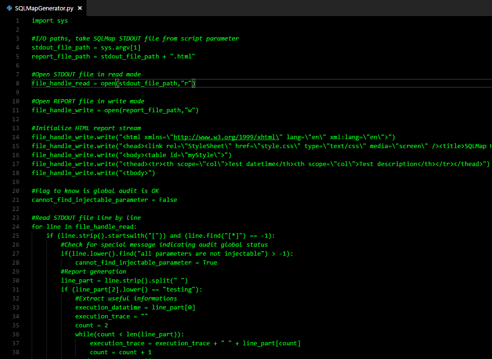
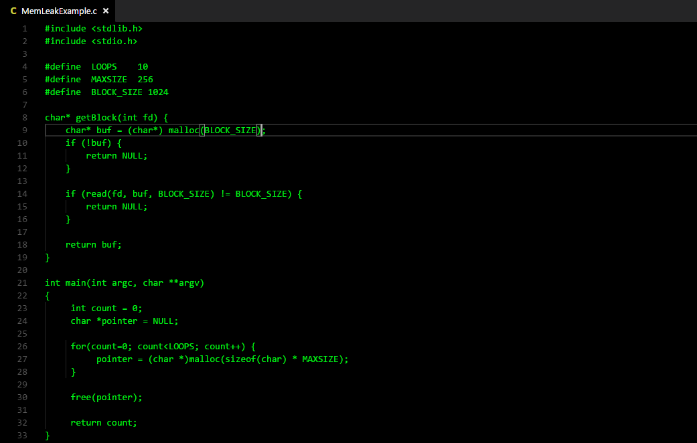

# Hack3r theme for VS Code

This Visual Studio Code extension provides all that you need for those times when overflows, forgeries, or injections are your best solution for the problem at hand.

## Usage

CTRL+K, CTRL+T, in rapid succession and select 'Hack3r.'
Keep F11 or CTRL+K, Z in mind for maximum effect.